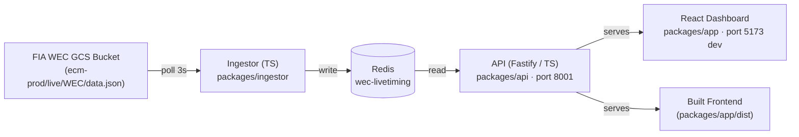

# WEC Live Dashboard 🏁

Real-time live timing dashboard for **FIA World Endurance Championship** races including the **24 Hours of Le Mans**. Polls the public FIA WEC timing JSON feed, stores snapshots in Redis, and serves a React frontend.

Built with TypeScript, Fastify, React 19, Tailwind v4, and pnpm.

## How It Works



The official FIA WEC live timing system writes a JSON file to a public GCS bucket every ~3 seconds during live sessions:

```
https://storage.googleapis.com/ecm-prod/live/WEC/data.json
```

No authentication required — it's the same data powering `fiawec.com` and `24h-lemans.com` live timing. Covers all WEC rounds: Qatar, Imola, Spa, Le Mans, São Paulo, Austin, Fuji, Bahrain.

**Not available:** GPS/XY car positions (sector-level only — no minimap), car telemetry, or replay of past sessions.

## Features

- **Live leaderboard** — class-coloured rows with position, driver flags, team, car
- **Class tabs** — filter All / Hypercar / LMP2 / LMGT3
- **Sector dots** — 3-dot indicator per car for current track sector
- **Position changes** — ▲ green (gained) / ▼ red (lost) arrows
- **Race progress** — percentage bar and race timer with remaining time
- **Weather bar** — air temp, track temp, humidity, pressure, wind
- **Expandable car detail** — click any row for full driver roster, sector times, gaps, tyre, state
- **Auto-refresh** — polls every 5 seconds

## Prerequisites

- Redis running on `localhost:6379`
- Node.js 22+ and pnpm

## Getting Started

```bash
# Install dependencies
pnpm install

# Build the frontend
pnpm --filter app run build

# Quick start (all services)
pnpm dev
```

The dev server on `:5173` proxies `/api/*` to the backend on `:8001`.

### Commands

| Command | Description |
|---------|-------------|
| `pnpm dev` | Start ingestor + API + frontend dev servers |
| `pnpm build` | Build all packages |
| `pnpm typecheck` | TypeScript check all packages |
| `pnpm clean` | Remove all `dist/` directories |
| `pnpm --filter ingestor run start` | Start the data ingestor |
| `pnpm --filter api run dev` | API server (port 8001) |
| `pnpm --filter app run dev` | Frontend dev server with HMR (port 5173) |

### Running Individually

**1. Ingestor** — poll live data into Redis:
```bash
pnpm --filter ingestor run start
```

**2. API** — serve JSON + built frontend (port 8001):
```bash
pnpm --filter api run dev
```

**3. Frontend (dev mode with hot reload on port 5173):**
```bash
pnpm --filter app run dev
```

## Services

| Service | URL |
|---------|-----|
| Dashboard (built) | `http://localhost:8001` |
| Dev dashboard | `http://localhost:5173` |
| API | `http://localhost:8001/api/current` |

## API Endpoints

| Endpoint | Description |
|----------|-------------|
| `GET /api/current` | Full live snapshot — session info, weather, all entries |
| `GET /api/entries?category=HYPERCAR` | Per-car data, filterable by class |
| `GET /api/entries/{id}` | Single car detail |
| `GET /api/sessions` | Known session history |
| `GET /api/history` | Raw snapshot archive |

## Data Source Notes

- **Endpoint:** `https://storage.googleapis.com/ecm-prod/live/WEC/data.json`
- The data is owned by Al Kamel Systems S.L. — personal use only
- The ACO has previously shut down third-party live timing services — this is for personal use

## Related

- [FIA WEC Live Timing](https://fiawec.alkamelsystems.com/) — official timing site
- [24 Hours of Le Mans](https://www.24h-lemans.com/en) — official event site
- [OpenF1](https://openf1.org/) — open-source F1 API (inspiration for this project)
