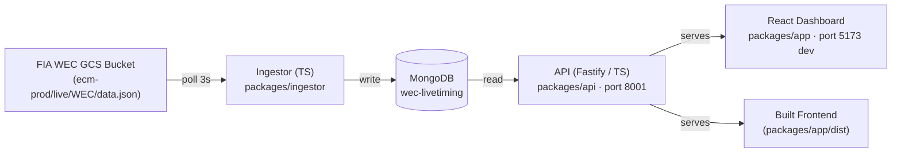

# WEC Live Dashboard

Real-time live timing dashboard for **FIA World Endurance Championship** races including the **24 Hours of Le Mans**. Polls the public timing JSON feed, stores snapshots in MongoDB, and serves a React dashboard.

## How It Works



### Data Source

The official FIA WEC live timing system writes a JSON file to a public Google Cloud Storage bucket every ~3 seconds during live sessions:

```
https://storage.googleapis.com/ecm-prod/live/WEC/data.json
```

This is the same data that powers the official `fiawec.com` and `24h-lemans.com` live timing pages. No authentication required — it's a public bucket.

Covers all WEC rounds: Qatar, Imola, Spa, Le Mans, São Paulo, Austin, Fuji, Bahrain.

### What Data Is Available

**Per car (up to 62 entries):**
- Position, car number, driver, team, car model, class
- Lap count, best lap, last lap, sector times, speed
- Gaps (to leader, to class leader, to car ahead — in time or laps)
- Pit stop count
- Current track sector (1/2/3)
- Position changes (gained/lost)
- Full driver roster (3 per car) with names, nationalities, license grades
- Current state (on track / in pits)

**Session:**
- Race timer, remaining time, flag state (green/yellow/SC)
- Weather: air temp, track temp, humidity, pressure, wind
- Race progress percentage

**Not available:**
- GPS / XY car positions (sector-level only — no minimap)
- Car telemetry (no throttle/brake/gear/speed traces)
- Live timing data only exists during live sessions (no replay from GCS)

## Project Structure

```
wec-dashboard/
├── packages/
│   ├── api/                    # Fastify + TypeScript API server (port 8001)
│   │   ├── src/
│   │   │   ├── index.ts       # Server entry, static files, routing
│   │   │   ├── db.ts          # MongoDB client
│   │   │   ├── types.ts       # Shared TypeScript interfaces
│   │   │   └── routes/
│   │   │       ├── current.ts # GET /api/current
│   │   │       ├── entries.ts # GET /api/entries & /api/entries/:id
│   │   │       ├── sessions.ts# GET /api/sessions
│   │   │       └── history.ts # GET /api/history
│   │   ├── package.json
│   │   └── tsconfig.json
│   ├── ingestor/                # TypeScript ingestor (polls GCS → MongoDB)
│   │   ├── src/
│   │   │   ├── index.ts       # Poller loop, storage, dedup
│   │   │   └── types.ts       # Raw data interfaces
│   │   ├── package.json
│   │   └── tsconfig.json
│   └── app/                    # React + TypeScript + Tailwind v4 + Vite
│       ├── src/
│       │   ├── App.tsx
│       │   ├── api/client.ts  # API fetch functions
│       │   ├── types/index.ts # Frontend TypeScript interfaces
│       │   ├── index.css      # Tailwind v4 imports + custom theme
│       │   └── components/
│       │       ├── Leaderboard.tsx   # Main table: flags, sector dots, position Δ
│       │       ├── SessionInfo.tsx   # Timer, flag, progress bar
│       │       ├── WeatherWidget.tsx # Track/air temps, humidity, wind
│       │       └── ClassFilter.tsx   # Class tab buttons
│       ├── index.html
│       ├── package.json
│       ├── tsconfig.json
│       └── vite.config.ts     # Dev proxy: /api → localhost:8001
├── pnpm-workspace.yaml        # pnpm monorepo config
├── package.json               # Root scripts (dev, build, typecheck)
├── start.sh                   # Launch all 3 services
└── README.md
```

## Setup

### Prerequisites

- MongoDB running on `localhost:27017`
- Node.js 22+ with `pnpm` (any recent version)

### Install Dependencies

```bash
pnpm install
```

This installs dependencies for both `packages/api` and `packages/app`.

### Build the Frontend

```bash
pnpm --filter app run build
```

This produces `packages/app/dist/` which the API server serves as static files.

| Service | URL |
|---|---|
| Dashboard (built) | `http://localhost:8001` |
| Dev dashboard | `http://localhost:5173` |
| API | `http://localhost:8001/api/current` |

## Running

### Quick Start (all services)

```bash
./start.sh
```

### Or Run Individually

**1. Ingestor** — poll live data into MongoDB:
```bash
pnpm --filter ingestor run start
```

**2. API** — serve JSON + built frontend (port 8001):
```bash
pnpm --filter api run dev
```

**3. Frontend (dev mode with hot reload on port 5173):**
```bash
pnpm --filter app run dev
```

The dev server on `:5173` proxies `/api/*` to the backend on `:8001`.

### Workspace Commands

| Command | Description |
|---|---|
| `pnpm dev` | Start API + frontend dev servers (run ingestor separately) |
| `pnpm build` | Build all packages |
| `pnpm typecheck` | TypeScript check all packages |
| `pnpm clean` | Remove all `dist/` directories |
| `pnpm --filter ingestor run start` | Start the data ingestor |

## API Endpoints

| Endpoint | Description |
|---|---|
| `GET /api/current` | Full live snapshot — session info, weather, all entries |
| `GET /api/entries?category=HYPERCAR` | Per-car data, filterable by class |
| `GET /api/entries/{id}` | Single car detail |
| `GET /api/sessions` | Known session history |
| `GET /api/history` | Raw snapshot archive |

## Dashboard Features

- **Live leaderboard** — class-coloured rows with position, driver flags, team, car
- **Class tabs** — filter All / Hypercar / LMP2 / LMGT3
- **Sector dots** — 3-dot indicator per car showing current track sector
- **Position changes** — ▲ green (gained) / ▼ red (lost) arrows
- **Driver flags** — country flag emoji from driver nationality data
- **Race progress** — percentage bar in the header
- **Weather bar** — air temp, track temp, humidity, pressure, wind
- **Expandable car detail** — click any row for full driver roster, sector times, gaps, 2nd best lap, tyre, state
- **Auto-refresh** — polls every 5 seconds

## Data Source Notes

- **Endpoint:** `https://storage.googleapis.com/ecm-prod/live/WEC/data.json`
- **Previous endpoint** (now stale, 2021 prologue data): `https://storage.googleapis.com/fiawec-prod/assets/live/WEC/__data.json`
- The data is owned by Al Kamel Systems S.L. — personal use only
- The ACO has previously shut down third-party live timing services (James Muscat, 2019) — this is for personal use

## Stack

- **Ingestor:** TypeScript (`packages/ingestor`)
- **API:** Fastify + TypeScript (`packages/api`)
- **Frontend:** React 19 + TypeScript + Tailwind v4 + Vite (`packages/app`)
- **Workspace:** pnpm monorepo
- **Database:** MongoDB (`wec-livetiming`)

## Related

- [FIA WEC Live Timing](https://fiawec.alkamelsystems.com/) — official timing site
- [24 Hours of Le Mans](https://www.24h-lemans.com/en) — official event site
- [OpenF1](https://openf1.org/) — open-source F1 API (inspiration for this project)
